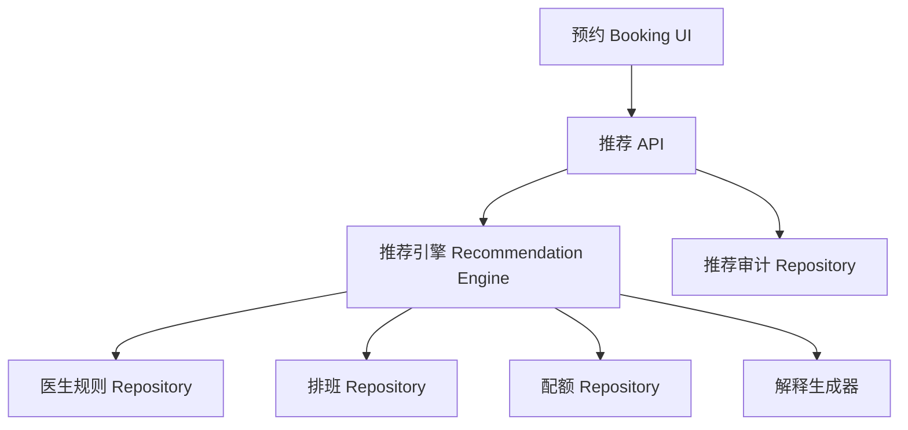

# Architecture（架构）：医生个性化推荐引擎

## Architecture Overview（架构概览）

采用围绕预约流程的 plugin-style constraint engine（插件式约束引擎）。该引擎不拥有 Patient、Appointment、Check-in、Visit 生命周期，只从预约流程接收推荐请求，评估医生/服务/排班/规则/配额约束，返回推荐与解释，并写入审计证据。

核心判断：医生推荐不是简单 filter，而是 constraint satisfaction problem（约束满足问题）。硬规则阻塞候选，软规则降低置信度或生成 warning，解释信息让前台能够信任和升级处理。

## Directory Structure（目录结构）

```text
src/modules/doctor-recommendation/
├── domain/
│   ├── Doctor.ts
│   ├── DoctorRule.ts
│   ├── RecommendationRequest.ts
│   └── RecommendationDecision.ts
├── engine/
│   ├── evaluateDoctor.ts
│   ├── recommendDoctors.ts
│   └── explainDecision.ts
├── adapters/
│   ├── scheduleRepository.ts
│   ├── quotaRepository.ts
│   └── auditRepository.ts
├── api/
│   └── recommendationRoutes.ts
└── tests/
    ├── doctorRules.spec.ts
    └── recommendationApi.spec.ts
```

## Component Tree（组件关系）



## Data Models（数据模型）

```ts
type RuleEffect = "BLOCK" | "WARN" | "BOOST";
type RuleSeverity = "hard" | "soft";

interface DoctorRule {
  id: string;
  doctorId: string;
  type: "time" | "service" | "date" | "location" | "age" | "workload" | "surgery-combination" | "quota";
  condition: Record<string, unknown>;
  effect: RuleEffect;
  severity: RuleSeverity;
  explanation: string;
  version: string;
  effectiveFrom: string;
  effectiveTo?: string;
  active: boolean;
}

interface RecommendationRequest {
  service: string;
  appointmentDate: string;
  time: string;
  location: "Central" | "Mong Kok" | "HK" | string;
  patientAge?: number;
  visitType: "new" | "follow-up" | "surgery";
  preferredDoctor?: string;
}

interface RecommendationDecision {
  recommended: DoctorRecommendation[];
  blocked: BlockedDoctor[];
  warnings: string[];
  appliedRuleVersions: string[];
  auditId?: string;
}
```

## API Contracts（API 契约）

| Method | Path | 目的 |
|---|---|---|
| POST | `/api/doctor-recommendations` | 返回推荐医生和被阻塞医生 |
| GET | `/api/doctor-rules?doctorId=` | 查看配置化规则 |
| POST | `/api/doctor-rules` | 创建新的规则版本 |
| POST | `/api/recommendation-audits/{id}/selection` | 记录最终选择或 override |

### POST `/api/doctor-recommendations`

Request:

```json
{
  "service": "SMILE",
  "appointmentDate": "2026-06-20",
  "time": "13:30",
  "location": "Mong Kok",
  "patientAge": 34,
  "visitType": "surgery",
  "preferredDoctor": "Dr Sin"
}
```

Response:

```json
{
  "recommended": [
    {
      "doctor": "Dr Kwok",
      "score": 86,
      "reasons": ["当患者指定 Dr Sin 做 SMILE 时，Dr Kwok 是配置的替代医生"]
    }
  ],
  "blocked": [
    {
      "doctor": "Dr Sin",
      "rules": ["Dr Sin 不接 SMILE，应安排 Dr Kwok"]
    }
  ],
  "auditId": "rec_..."
}
```

## Tech Choices（技术取舍）

| 决策 | 选项 A | 选项 B | 选择 | 理由 |
|---|---|---|---|---|
| 规则评估 | 确定性约束引擎 | ML ranking | 确定性优先 | 规则是明确的临床/运营约束，解释性更重要 |
| 规则存储 | 版本化表 | 仅 JSON 文件 | 版本化表 | 需要审计和规则变更追溯 |
| 推荐输出 | 只返回 top doctor | 推荐 + 阻塞 + 原因 | 推荐 + 阻塞 + 原因 | 前台需要信任和升级处理证据 |
| 集成方式 | 替换预约流程 | 预约流程旁路 plugin API | plugin API | 风险更低，保留现有 Appointment 生命周期 |

## Verification Strategy（验证策略）

| 检查 | 命令/方式 | 覆盖范围 |
|---|---|---|
| 参考实现单元测试 | `npm run test:doctor-preference-e2e` | Dr Sin、Dr Tang、Dr Ho、Dr Leung、quota、解释 |
| E2E 结构检查 | `npm run validate:doctor-preference-e2e` | Output Packet 和证据覆盖 |
| 生产集成 | `[future] recommendation API integration tests` | 真实排班/服务/配额数据 |
| 人工 smoke | 原型场景：SMILE + Dr Sin -> Dr Kwok | 前台可解释推荐路径 |
| 隐私/安全 | 审查 audit payload 的 PII 最小化 | 患者数据和运营日志 |

## Sensor Gates

| Sensor | 结果 |
|---|---|
| Spec Coverage | PASS（通过），覆盖参考 MVP；生产 schema 仍开放 |
| Build/Test | PASS（通过），参考实现测试后成立 |
| Privacy/Security | PARTIAL（部分通过）；定义了 audit payload，最终 PII 策略待定 |
| Overengineering | PASS（通过）；plugin API 避免替换预约生命周期 |

## Output Packet

- **artifact_path**: `evals/doctor-preference-e2e/outputs/04-architecture.md`
- **artifact_type**: `architecture`
- **key_decisions**: 确定性规则引擎；版本化规则存储；plugin integration。
- **open_assumptions**: 本 eval 未检查 ClarityMedic active repo 的真实持久化和 API framework。
- **next_skill_hint**: `pm-code-implement`
- **handoff_context**: 先用参考实现验证规则语义，再做生产集成。
- **verification_strategy**: 见上表
- **sensor_gates**: Spec Coverage PASS；Build/Test PASS after reference tests；Privacy/Security PARTIAL
