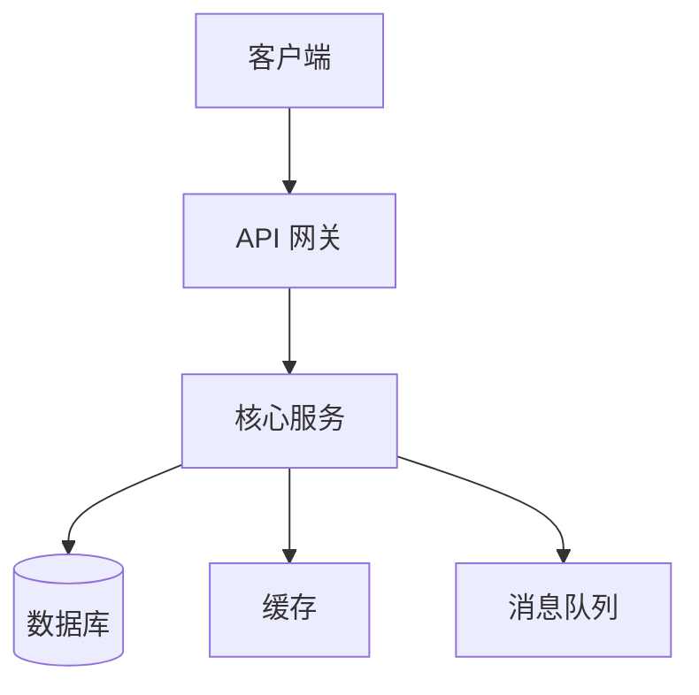
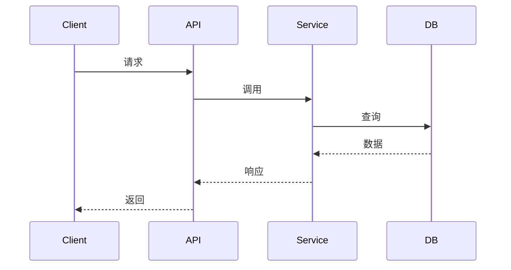
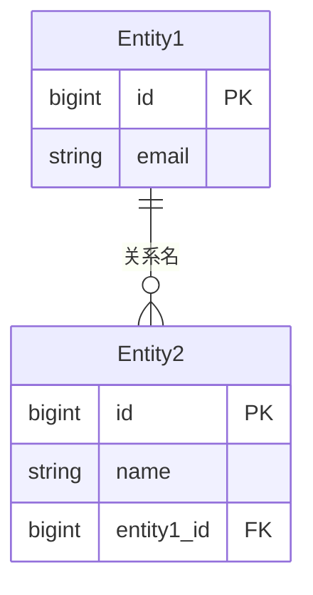

# 技术规格输出模板

> 完整的技术规格输出模板，遵循 `.claude/TEMPLATE-ENGINE.md` 规范

---

```markdown
---
Doc_ID: TS-{Sequence}
Title: {功能/系统名称} 技术规格
Type: /technical-spec
Status: Draft
Confidence_Score: {1-10}
Date: YYYY-MM-DD
Author: PM Copilot x {用户名}
Linked_Docs: [{prd-id}]
Tags: [Technical-Spec, {标签}]
Version: 1.0
---

## TL;DR

1. **系统目的**: {一句话}
2. **核心技术**: {主要技术栈}
3. **关键决策**: {最重要的技术决策}

---

## 1. 概述

### 1.1 目的

{描述系统做什么，为什么需要}

### 1.2 范围

**In Scope**:
- {范围项1}
- {范围项2}

**Out Scope**:
- {排除项}: {原因}

### 1.3 关键目标

- **性能**: {具体指标}
- **可扩展性**: {具体指标}
- **可靠性**: {具体指标}

---

## 2. 架构设计

### 2.1 系统架构



### 2.2 组件定义

| 组件 | 职责 | 技术栈 | 接口 |
| --- | --- | --- | --- |
| {组件1} | {职责} | {技术} | {接口} |
| {组件2} | {职责} | {技术} | {接口} |

### 2.3 交互流程



---

## 3. 数据模型

### 3.1 实体定义

#### {实体名1}

| 字段 | 类型 | 必填 | 索引 | 说明 |
| --- | --- | --- | --- | --- |
| id | bigint | Y | PK | 主键 |
| {字段} | {类型} | {Y/N} | {索引} | {说明} |
| created_at | datetime | Y | - | 创建时间 |
| updated_at | datetime | Y | - | 更新时间 |

#### {实体名2}
[同上格式]

### 3.2 关系图



### 3.3 索引策略

| 索引名 | 字段 | 类型 | 用途 |
| --- | --- | --- | --- |
| idx_{name} | {字段} | BTREE | {查询场景} |

---

## 4. API 规范

### 4.1 端点列表

| 端点 | 方法 | 描述 | 认证 |
| --- | --- | --- | --- |
| /api/resource | GET | 获取列表 | Bearer |
| /api/resource/:id | GET | 获取详情 | Bearer |
| /api/resource | POST | 创建 | Bearer |
| /api/resource/:id | PUT | 更新 | Bearer |
| /api/resource/:id | DELETE | 删除 | Bearer |

### 4.2 端点详情

#### GET /api/resource

**描述**: {说明}

**请求参数**:
| 参数 | 类型 | 必填 | 说明 |
| --- | --- | --- | --- |
| {param} | {type} | {Y/N} | {desc} |

**请求示例**:
```http
GET /api/resource?page=1&limit=20
Authorization: Bearer {token}
```

**响应示例**:
```json
{
  "success": true,
  "data": {
    "items": [...],
    "total": 100,
    "page": 1,
    "limit": 20
  }
}
```

**错误响应**:
| 状态码 | 说明 |
| --- | --- |
| 400 | 参数错误 |
| 401 | 未认证 |
| 403 | 无权限 |
| 404 | 资源不存在 |
| 500 | 服务器错误 |

#### POST /api/resource
[同上格式]

---

## 5. 非功能需求

### 5.1 性能要求

| 指标 | 目标值 | 测量方式 |
| --- | --- | --- |
| API 响应时间 (P50) | < 100ms | APM |
| API 响应时间 (P99) | < 500ms | APM |
| 并发用户 | {数} | 压力测试 |
| 吞吐量 | {QPS} | 压力测试 |

### 5.2 可扩展性

- **水平扩展**: {说明如何扩展}
- **缓存策略**: {缓存方案}
- **CDN**: {静态资源加速}

### 5.3 安全

| 需求 | 实现方式 |
| --- | --- |
| 认证 | JWT Bearer Token |
| 授权 | RBAC 权限控制 |
| 数据传输 | TLS 1.3 |
| 数据存储 | 敏感字段加密 |
| 合规 | {GDPR/PIPL 要求} |

### 5.4 可靠性

| 指标 | 目标值 | 实现方式 |
| --- | --- | --- |
| 可用性 | 99.9% | 高可用架构 |
| 数据持久性 | 99.999% | 主从复制 |
| 故障恢复 | < 5 分钟 | 自动故障转移 |

### 5.5 监控

| 类型 | 指标 | 告警 |
| --- | --- | --- |
| 应用 | 错误率 > 1% | 立即 |
| 应用 | 响应时间 > 1s | 警告 |
| 系统 | CPU > 80% | 警告 |
| 系统 | 内存 > 85% | 警告 |

---

## 6. 技术决策

### 6.1 决策记录

| 决策 | 选项 | 选择 | 理由 |
| --- | --- | --- | --- |
| {技术选型} | 方案A / 方案B | {方案} | {理由} |
| {架构选择} | 单体 / 微服务 | {方案} | {理由} |

### 6.2 关键决策说明

#### 决策 1: {决策标题}

**背景**: {为什么需要做这个决策}

**考虑的选项**:
- **选项A**: {说明} - 优缺点
- **选项B**: {说明} - 优缺点
- **选项C**: {说明} - 优缺点

**最终选择**: {选项}

**理由**: {详细说明}

**后果**: {这个决策的影响}

---

## 7. 实施考虑

### 7.1 开发阶段

| 阶段 | 任务 | 预计时长 | 依赖 |
| --- | --- | --- | --- |
| 阶段1 | {任务} | {时长} | {依赖} |
| 阶段2 | {任务} | {时长} | {依赖} |

### 7.2 技术债务

| 债务 | 影响 | 偿还计划 |
| --- | --- | --- |
| {技术债务} | {影响} | {计划} |

### 7.3 迁移策略

**从旧系统迁移** (如适用):
1. **阶段1**: {描述} - {时长}
2. **阶段2**: {描述} - {时长}
3. **阶段3**: {描述} - {时长}

**回滚计划**:
- {回滚步骤1}
- {回滚步骤2}

---

## 8. 依赖关系

### 8.1 外部依赖

| 依赖 | 版本 | 用途 | 风险 |
| --- | --- | --- | --- |
| {依赖1} | {版本} | {用途} | {风险} |

### 8.2 服务依赖

| 服务 | 端点 | SLA | 降级方案 |
| --- | --- | --- | --- |
| {服务} | {endpoint} | {SLA} | {方案} |

---

## 9. 测试策略

### 9.1 测试类型

| 类型 | 覆盖范围 | 工具 |
| --- | --- | --- |
| 单元测试 | {目标}% | Jest |
| 集成测试 | {目标}% | Supertest |
| E2E 测试 | {关键流程} | Playwright |
| 性能测试 | {目标QPS} | k6 |
| 安全测试 | {OWASP Top 10} | 手动/工具 |

### 9.2 测试数据

- **生产数据**: {是否使用，如何脱敏}
- **合成数据**: {数据生成策略}

---

## 10. 未决问题

| 问题 | 优先级 | 负责人 | 截止日期 |
| --- | --- | --- | --- |
| {问题} | P0/P1/P2 | {负责人} | {日期} |

---

## 残酷风险区 (Trade-offs)

### 牺牲了什么

- **{牺牲项}**: {为什么}
- **{牺牲项}**: {为什么}

### 最大失败风险

- **{风险}**: {场景}

### 防御方案

- **{风险}**: {措施}

---

## 下一步 (DPER Loop)

### Data
- [ ] 收集性能基准数据
- [ ] 分析现有系统瓶颈

### Plan
- [ ] 技术评审
- [ ] 架构评审

### Execute
- [ ] 搭建开发环境
- [ ] 开始阶段1开发

### Reflect
- [ ] 架构决策回顾
- [ ] 技术债务评估

---

## 附录

### A. 术语表

| 术语 | 定义 |
| --- | --- |
| {术语} | {定义} |

### B. 参考文档

- {文档1}: {链接}
- {文档2}: {链接}
```
---

## 模板使用指南

### 文档范围

**适用于**:
- 新功能技术规格
- 系统重构规格
- API 设计规格
- 数据模型规格

**不适用于**:
- 简单 bug 修复
- 小型改动（直接 PR 描述）
- 纯前端改动（无后端变更）

### 章节选择

**最小规格** (简单功能):
1. 概述
2. 数据模型
3. API 规范
4. 残酷风险区
5. 下一步

**完整规格** (复杂系统):
- 所有章节

### 常见模式

**API 优先**:
- 聚焦 API 规范章节
- 简化架构设计

**数据优先**:
- 聚焦数据模型章节
- 详细 ERD 和索引

**性能优先**:
- 聚焦非功能需求
- 详细的性能指标和测试
```